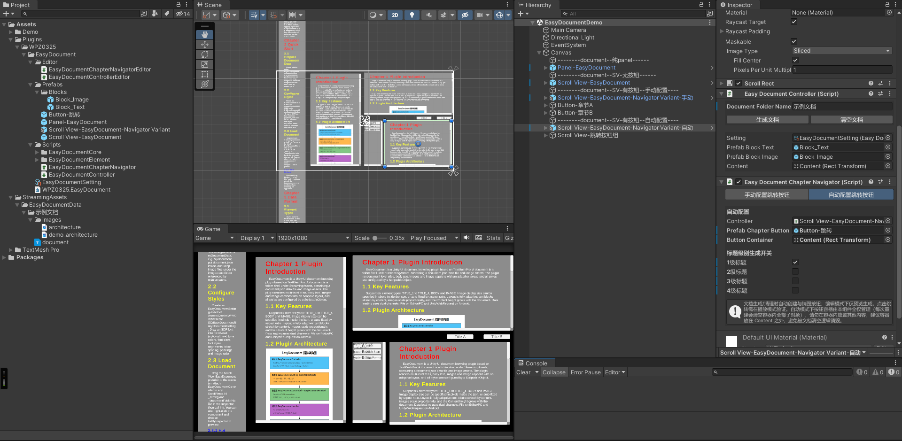

# Unity3D-Easy-Document

基于 TMP（TextMeshPro）的 Unity UI 文档浏览插件。

以 StreamingAssets 下的文件夹为文档壳，支持多级标题、正文、图片与图片标题的展示，布局自适应，样式由 ScriptableObject 统一配置；配套章节导航器，支持手动/自动两种跳转按钮配置模式。

## 功能特性

- 支持 1~4 级标题、正文、图片、图片标题六种元素类型
- 章节导航：自动识别标题生成章节索引，按钮一键平滑滚动定位（手动拖入 / 自动生成两种模式）
- 自动配置模式：拖入按钮预制体 + 挂载 root，按 TITLE_1~4 开关自动生成并绑定章节按钮，清空文档自动销毁
- 图片显示尺寸可在 json 中按像素指定，未指定时按比例自适应
- 文档数据以文件夹为壳（json + 图片资源），便于外部维护与热替换
- 双通道加载：Editor/PC 使用 File 同步读取，Android 使用 UnityWebRequest 异步读取
- 样式统一配置（颜色、字号、字重、对齐、SDF 字体），运行时生效
- 布局自适应：文本块按内容撑高，图片按宽高比缩放，Content 高度随内容增长

## 界面效果

内容自动适配不同大小的文档区域，章节按钮可一键平滑滚动定位：



## 目录结构

```
Assets/
├── Plugins/WPZ0325/EasyDocument/               # 插件本体
│   ├── EasyDocumentDemo.unity                  # 演示场景
│   ├── EasyDocumentSetting.asset               # 样式配置资源（ScriptableObject）
│   ├── Scripts/
│   │   ├── WPZ0325.EasyDocument.asmdef         # 运行时程序集定义
│   │   ├── EasyDocumentCore/                   # 核心逻辑（Controller/Handler/DataModel/Setting 等）
│   │   ├── EasyDocumentElement/                # 内容块元素脚本
│   │   ├── EasyDocumentController.cs           # 文档控制器（生成/清空文档）
│   │   └── EasyDocumentChapterNavigator.cs     # 章节导航器（手动/自动双模式）
│   ├── Editor/
│   │   ├── WPZ0325.EasyDocument.Editor.asmdef  # 编辑器程序集定义（仅 Editor 平台）
│   │   ├── EasyDocumentControllerEditor.cs     # 控制器面板
│   │   └── EasyDocumentChapterNavigatorEditor.cs # 导航器面板（手动/自动 tab）
│   └── Prefabs/                                # 整件预制体 + Blocks/ 内容块预制体 + 章节按钮预制体
└── StreamingAssets/EasyDocumentData/           # 文档数据目录（<文档名>/document.json + 图片）
```

## 文档数据格式

文档存放于 `StreamingAssets/EasyDocumentData/` 下，每个文档一个文件夹，文件夹名即文档名：

```
EasyDocumentData/
└── 我的文档/
    ├── document.json
    └── images/xxx.png
```

document.json 结构：

```json
{
    "DocumentName": "我的文档",
    "Elements": [
        { "Type": "TITLE_1", "Text": "第一章 简介" },
        { "Type": "BODY", "Text": "正文内容……" },
        { "Type": "IMAGE", "Text": "", "ImagePath": "images/xxx.png",
          "Caption": "图1 示例", "ImageWidth": 800, "ImageHeight": 480 }
    ]
}
```

| 字段 | 说明 |
|---|---|
| `DocumentName` | 文档名称 |
| `Type` | 元素类型：`TITLE_1` / `TITLE_2` / `TITLE_3` / `TITLE_4` / `BODY` / `IMAGE` |
| `Text` | 文本内容（IMAGE 类型可为空） |
| `ImagePath` | 图片相对本文档文件夹的路径（IMAGE 类型使用） |
| `Caption` | 图片标题（IMAGE 类型的子字段） |
| `ImageWidth` / `ImageHeight` | 图片显示宽高（像素），`>0` 生效；`0`/省略时按比例自适应 |

## 快速开始

1. 在 `StreamingAssets/EasyDocumentData/` 下创建文档文件夹（含 document.json 与图片资源）
2. 创建样式配置：菜单 `Assets > Create > WPZ0325 > Create SO > EasyDocument > EasyDocumentSetting`
3. 场景放置（三选一）：
   - 推荐：打开 `EasyDocumentDemo` 演示场景，或拖入 `Scroll View-EasyDocument-Navigator` 预制体（内置文档 UI 与章节导航器）
   - 或拖入 `Panel-EasyDocument` 预制体，已内置完整文档 UI 结构
   - 或自行搭建 UI 后挂载 `EasyDocumentController`，并把文档内容挂载点拖入 `_content`
4. Inspector 配置：样式资源 `_setting`、文档文件夹名 `_documentFolderName`、内容挂载点 `_content`（必填）
5. 点击"生成文档"按钮即可在编辑器中预览，"清空文档"清除内容
6. 运行时调用：

```csharp
EasyDocumentController controller = GetComponent<EasyDocumentController>();
controller.Init("我的文档");
```

## 编辑器面板

### EasyDocumentController（文档操作与配置）

**文档操作区**

| 项目 | 说明 |
|---|---|
| `_documentFolderName` | 文档文件夹名（StreamingAssets/EasyDocumentData 下的目录名） |
| 生成文档 | 编辑器中加载并生成文档内容（非播放模式可直接预览） |
| 清空文档 | 销毁 Content 下全部已生成内容块 |

**配置区**

| 字段 | 必填 | 说明 |
|---|---|---|
| `_setting` | 建议 | 样式配置资产（EasyDocumentSetting） |
| `_prefabBlockText` | 可选 | 文本块预制体，留空自动构建 |
| `_prefabBlockImage` | 可选 | 图片块预制体，留空自动构建 |
| `_content` | **必填** | 文档内容挂载点（RectTransform） |

### EasyDocumentChapterNavigator（章节导航）

面板顶部为模式 tab，两种跳转按钮配置模式二选一。

## 章节导航

长文档支持"点击按钮 → 平滑滚动到对应章节"。挂载方式：将 `EasyDocumentChapterNavigator` 挂到含 `ScrollRect` 的物体上（或直接用 `Scroll View-EasyDocument-Navigator` 预制体）。

### 手动配置跳转按钮模式（默认）

1. Inspector 配置：`_controller`（联动生成/清理事件）、`_smoothDuration`（滚动时长/秒）、`_smoothType`（Linear / EaseIn / EaseOut / EaseInOut）
2. 生成文档后，面板"章节索引"自动列出全部标题，每个章节行的按钮槽可拖入 UI 按钮，运行时点击即滚动；未拖入的章节自动跳过
3. 清空文档时按钮绑定自动解绑，重新生成后需重新拖入

### 自动配置跳转按钮模式

拖入按钮预制体与生成 root 后，组件在文档生成时自动完成按钮创建与点击绑定，清空文档时自动解绑并销毁：

| 字段 | 说明 |
|---|---|
| `_prefabChapterButton` | 章节按钮预制体（可空；留空自动构建 Image+Button+TMP，根对象缺 TMP 时自动创建子文本对象） |
| `_buttonContainer` | 按钮生成挂载 root（**自动模式下由组件全权管理**，每次重建清空容器内全部子对象） |
| `_generateTitle1~4` | 各级标题是否生成按钮的开关 |

行为说明：

- 文档生成事件 → 按章节顺序过滤启用级别 → 创建按钮并绑定 `ScrollToChapter(真实index)`
- 文档清空 → 销毁全部自动按钮并解绑监听
- 编辑器下即时预览生成（修改配置即生效），点击跳转需在播放模式验证
- 运行时切换模式可用代码：

```csharp
navigator.ButtonMode = EnChapterButtonMode.Auto;   // 立即重建/清理对应按钮
```

> 注意：`_buttonContainer` 请放在文档 Content 之外（如侧边栏），避免被"清空文档"逻辑一并销毁；容器内请勿放置其他内容。

### 运行时 API

```csharp
EasyDocumentChapterNavigator navigator = GetComponent<EasyDocumentChapterNavigator>();
navigator.ScrollToChapter(0);               // 按章节序号滚动（index 从 0 开始）
navigator.ScrollToChapterByTitle("第一章");  // 按标题模糊匹配滚动
navigator.ScrollToChapter(1, () => Debug.Log("滚动完成"));  // 完成回调
```

> 提示：面板"复制调用代码"可一键复制全部章节调用示例；文档生成/清空时索引自动同步，无需手动刷新。

## 样式配置说明

| 配置项 | 说明 |
|---|---|
| `FontAsset` | SDF 字体，留空回退 TMP 默认字体 |
| `BlockSpacing` / `ContentPadding` | 元素间距与内容内边距 |
| `TextBlockPaddingX` | 文本块内文字与块左右两侧的距离（像素） |
| `ImageMaxWidthRatio` | 图片最大宽度占内容宽度比例（未指定宽高时生效） |
| 各级标题/正文/图片标题 | 颜色、字号、字重、对齐方式 |

## 注意事项

- 中文内容需要支持中文的 SDF 字体（TMP Font Asset Creator 用微软雅黑等生成）
- 编辑器"生成文档"后需保存场景，否则进入播放模式内容丢失
- 修改文档数据后，重新"生成文档"或调用 `Init` 即可刷新
- 自动配置模式每次重建会清空按钮容器全部子对象，请勿在容器内放置其他内容
- 插件按程序集划分：运行时 `WPZ0325.EasyDocument`（Any 平台）与编辑器 `WPZ0325.EasyDocument.Editor`（仅 Editor 平台），打包时编辑器程序集自动排除
